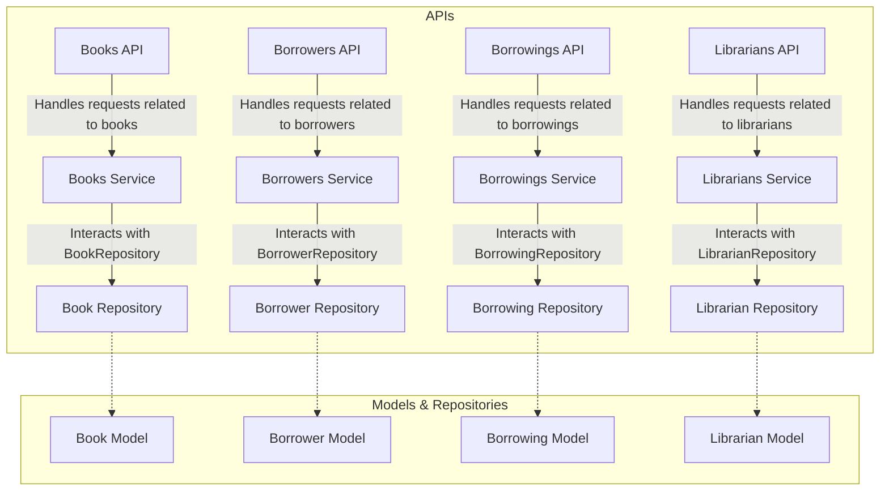

# Architecture Documentation

This document provides an overview of the architecture used in the development of the library management system. The architecture follows a layered approach, consisting of models, repositories, services, and APIs.

## Layers Overview

1. **Models**: The models layer represents the data structure of the application. It defines the structure of objects such as books, borrowers, borrowings, and librarians. Models typically include attributes and methods related to data manipulation.

2. **Repositories**: The repositories layer acts as an interface between the application and the database. It handles data access and manipulation operations, such as creating, reading, updating, and deleting records. Repositories abstract away the database operations from the higher layers.

3. **Services**: The services layer contains the business logic of the application. It orchestrates interactions between repositories and implements complex operations that involve multiple data entities. Services ensure that business rules are enforced and data integrity is maintained.

4. **APIs**: The APIs layer provides endpoints for interacting with the application. It exposes functionalities to external clients, such as web browsers or mobile applications, via RESTful API endpoints. APIs translate incoming requests into service calls and return appropriate responses.

## Architecture Diagram

## Conclusion

The layered architecture facilitates separation of concerns, making the application more modular, scalable, and maintainable. Models represent data entities, repositories handle database interactions, services encapsulate business logic, and APIs expose functionalities to external clients. This architecture promotes code reusability, testability, and extensibility, enabling efficient development and maintenance of the library management system.
