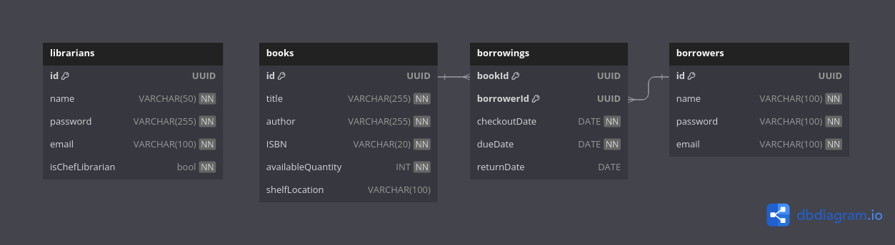

# Database Design Documentation

## Overview

This document provides an overview of the database design implemented using Sequelize ORM and PostgreSQL. The design includes models for managing books, borrowers, librarians, and borrowing transactions in a library management system.

## Database Schema

The database schema consists of the following tables:

### Books

-   **Primary Key**: id
-   **Indexes**: ISBN *(unique)*
-   **Attributes**: title, author, ISBN, available quantity, shelf location

### Borrowers

-   **Primary Key**: id
-   **Indexes**: email *(unique)*
-   **Attributes**: name, email, hashed password

### Borrowings

-   **Primary Key**: (bookId, borrowerId)
-   **Indexes**: bookId, borrowerId
-   **Attributes**: bookId (foreign key referencing Books), borrowerId (foreign key referencing Borrowers), checkout date, due date, return date

### Librarians

-   **Primary Key**: id
-   **Indexes**: email *(unique)*
-   **Attributes**: name, email, hashed password, role

## Diagram

