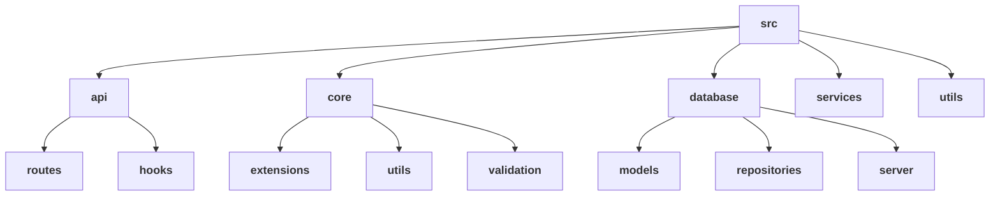

# Folder and File Structure Overview

This document provides an overview of the folder and file structure of the library management system project, explaining the rationale behind its design choices, along with its pros and cons.
Structure Explanation

The project directory consists of several directories and files, each serving a specific purpose:

**`src`**: Houses the source code of the application.

-   **`api`**: Contains API-related code, including routes and hooks.
-   **`core`**: Includes core functionalities and utilities used across the application.
-   **`database`**: Contains database-related code, including models, repositories, and server setup.
-   **`services`**: Houses service layer code responsible for business logic implementation.
-   **`utils`**: Contains utility functions and helpers used throughout the application.

## Why Choose This Structure?

-   **`Modularity and Organization`**: The structure adopts a modular approach, organizing directories by functionality, which promotes clean code architecture and makes it easier to locate and maintain code.

-   **`Scalability and Maintenance`**: Clear boundaries between components accommodate project growth and future enhancements. This logical organization simplifies maintenance tasks like debugging and testing, ensuring the scalability of the application.

-   **`Clear Organization, Reusability, and Maintainability`**: The intuitive directory layout enhances developer productivity and understanding. Moreover, the modular design fosters code reusability and maintainability across different parts of the application, streamlining development efforts.

## Conclusion

The chosen folder and file structure offer several benefits, including modularity, scalability, and maintainability. While there may be some learning curve and overhead associated with maintaining the structure, the long-term benefits outweigh the drawbacks. Overall, the structure provides a solid foundation for building and maintaining a robust library management system.
